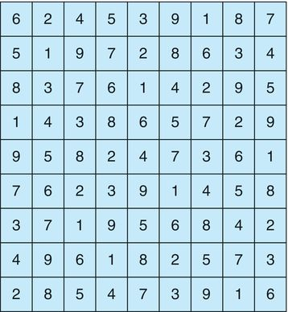

# Programming Lab 2 - Sudoku Solution Validator

## Learning Outcomes

By the end of this activity, a student should be able to:

1. Gain experience in C programming
2. Gain experience in writing multithreaded applications
2. Use system calls to accomplish tasks
3. Use memory allocation
4. Implement a makefile to compile and link your program

## Introduction

A **Sudoku** puzzle uses a 9 × 9 grid in which each column and row, as well as each of the nine 3 × 3 subgrids, must contain all of the digits 1 ⋯ 9. The figure below presents an example of a valid Sudoku puzzle. This project consists of designing a multithreaded application that determines whether the solution to a Sudoku puzzle is valid.
<p style="text-align:center">
<br/>
<span>Figure 1: Solution to a 9x9 Sudoku puzzle.</span>
</p>

There are several different ways of multithreading this application. One suggested strategy is to create threads that check the following criteria:

- A thread to check that each column contains the digits 1 through 9
- A thread to check that each row contains the digits 1 through 9
- Nine threads to check that each of the 3 × 3 subgrids contains the digits 1 through 9

This would result in a total of eleven separate threads for validating a Sudoku puzzle. However, you are welcome to create even more threads for this project. For example, rather than creating one thread that checks all nine columns or rows, you could create nine separate threads and have each of them check one column or one row.  This would result in twenty-seven separate threads.

## Representing the Sudoku board

The Sudoku board may be represented using a 1-dimensional array consisting of 9*9 = 81 elements or a 2-dimensional array of type int\*\*.  So, the 1-dimensional board is allocated as,

```
int* sudoku_board = (int*)malloc(sizeof(int)*81);
```
and the 2-dimensional board is allocated as,

```
int** sudoku_board = (int**)malloc(sizeof(int*)*ROW_SIZE);
for(int row = 0; row < ROW_SIZE; row++){
	sudoku_board[row] = (int*)malloc(sizeof(int)*COL_SIZE);
} 
```

For the 1-dimensional board, a translation will be required from (row,col) coordinates to index into the array.  So, the value at (2,3) will be located at index 2*ROW_SIZE+3 = 21.

## Structure of Input Files

The input files containing the board data will consist of nine (9) lines, where each line will contain nine (9) values of one row of the board, with each value separated by a comma (,). So, for the board shown in Figure 1 above, the input file will look like,

```
6,2,4,5,3,9,1,8,7
5,1,9,7,2,8,6,3,4
8,3,7,6,1,4,2,9,5
1,4,3,8,6,5,7,2,9
9,5,8,2,4,7,3,6,1
7,6,2,3,9,1,4,5,8
3,7,1,9,5,6,8,4,2
4,9,6,1,8,2,5,7,3
2,8,5,4,7,3,9,1,6
```

you can use the fscanf function with the "%d," format string inside of a nested loop to read each value into your `sudoku_board` 2-dimensional array.

## Passing Parameters to Each Thread

There are different strategies that can be adopted to verify the rows, columns, and 3x3 subgrids are valid.  One way is to write a function that validates a row, one that validates a column, and one that validates a 3x3 subgrid.

These functions each will need information on where to start.  The parent thread will create the worker threads, passing each worker the starting location that it must check in the Sudoku grid. This step will require passing several parameters to each thread. The easiest approach is to create a data structure using a struct. For example, a structure to pass the starting row, starting column, ending row, and ending column where a thread must begin and end validating would appear as follows:

```
/* structure for passing data to threads */
typedef struct
{
	int id; 
   int starting_row;
   int starting_col;
   int ending_row;
   int ending_col;
} param_struct;
```
This structure is provided in the lab2.h header file.

A program will create worker threads using a strategy similar to that shown below:

```
thread_t* tid = (thread_t*)malloc(sizeof(int)*NUM_OF_THREADS);
param_struct* params = (param_struct*)malloc(sizeof(param_struct)*NUM_OF_THREADS); 
params[0].id = 0; // id of first thread
params[0].starting_row = 0;
params[0].starting_col = 0;
params[0].starting_row = 3;
params[0].starting_row = 3;
/* Now create the thread passing it params[0] as a parameter */
pthread_create(&(tid[0]), &attr, validate, &(params[0]));
```
 
You will need to create an array, as illustrated above, to hold the parameters for each thread, as those need to be unique objects for each thread.  The same will be true for the thread id of type thread_t type.  All the threads can be provided with the same object of type thread_attr_t.  Here ```validate``` is the name of the function where each thread will begin executing.  You are welcome to create different functions to validate a column, row, or the 3x3 subgrid.

## Returning Results to the Parent Thread

Each worker thread is assigned the task of determining the validity of a particular region of the Sudoku puzzle. Once a worker has performed this check, it must pass its results back to the parent. One good way to handle this is to create an array of integer values that is visible to each thread. An integer pointer called `worker_validation` is declared in **lab2.h** header file.  The i<sup>th</sup> index in this array corresponds to the i<sup>th</sup> worker thread. If a worker sets its corresponding value to 1, it indicates that its region of the Sudoku puzzle is valid. A value of 0 indicates otherwise. When all worker threads have completed, the parent thread checks each entry in the result array to determine if the Sudoku puzzle is valid.  That is the purpose of the `id` field in the param_struct.  This field provides the index into the array where the thread should deposit its result.

## Lab Structure

The project contains X files.  These are,

1. <strong><u>lab2.h</u></strong> - header file that has all the #define macros, typedefs, the global variables for the sudoko board and the worker validation array.
2. <strong><u>lab2.c</u></strong> - where all implementation must take place.
3. <strong><u>main.c</u></strong> - entry point to program that reads sudoku board from file and calls is_sudoku_valid() function that must be implemented in **lab2.c**.
3. <strong><u>makefile</u></strong> - compiles and creates executable called **validate_sudoku**.
4. <strong><u>valid_board.txt</u></strong> - valid board for testing.
5.  <strong><u>invalid_board.txt</u></strong> - invalid board for testing.

You are welcome to create your own **lab1.h** file and use your own typedef defintions.   You are also welcome to add any function you want in **lab2.c**.  The only requirement is that you have an implementation of,

* ```int** read_board_from_file(char* filename);``` - returns a 2-dimensional integer array representing the board read from file.
* ```int is_board_valid();``` - returns a 1 if the board is valid; otherwise a 0

Of course, the function or functions you implement to handle the validation of the column, row, and subgrids must have ```void* worker_function(void* param)```, worker_function should be replaced by the name you give the function.  This signature is required by the Pthread library.

## Using the Template and Cloning

The lab is on your <a href="https://www.github.com/mrasamny/csci-320-lab2.git">instructor's Github repo</a> as public template.  This allows you to click the <span style="background-color:green; color:white;">&nbsp;&nbsp;Use this template&nbsp;&nbsp;</span> button on the instructor's repo page.  This will duplicate the repo on your account.  You can then clone your own repo of the lab and push updates and the final submission.

NOTE:  It is very important that you click on the <span style="background-color:green; color:white;">&nbsp;&nbsp;Use this template&nbsp;&nbsp;</span> button as your instructor will clone your repo to grade your lab.
